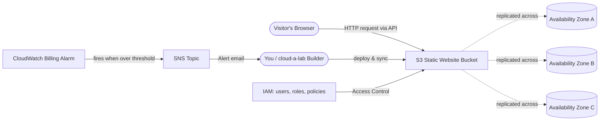

# Architecture Diagram

## The system you built

```mermaid
flowchart LR
    User([Visitor's Browser]) -->|HTTP request via API| S3[S3 Static Website Bucket]
    Dev([You / cloud-a-lab Builder]) -->|deploy & sync| S3
    IAM[IAM: users, roles, policies] -->|Access Control| S3
    S3 -.replicated across.-> AZ1[(Availability Zone A)]
    S3 -.replicated across.-> AZ2[(Availability Zone B)]
    S3 -.replicated across.-> AZ3[(Availability Zone C)]
    Billing[CloudWatch Billing Alarm] -->|fires when over threshold| SNS[SNS Topic]
    SNS -->|Alert email| Dev
```